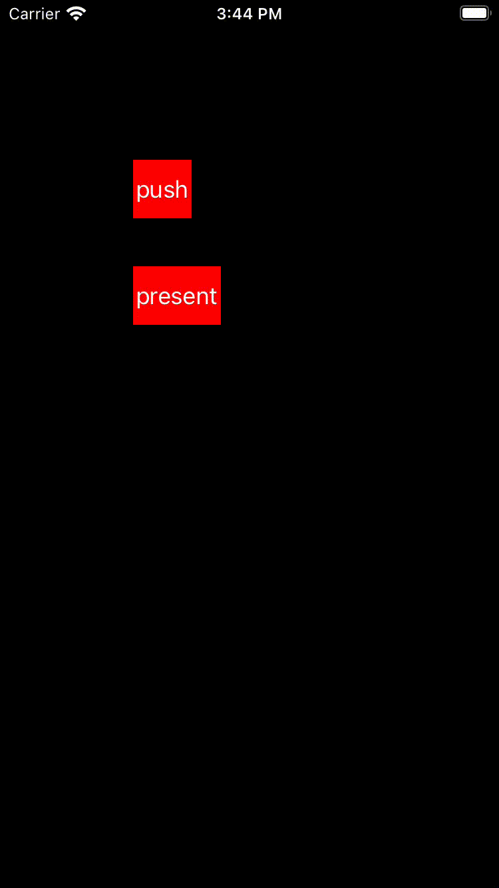
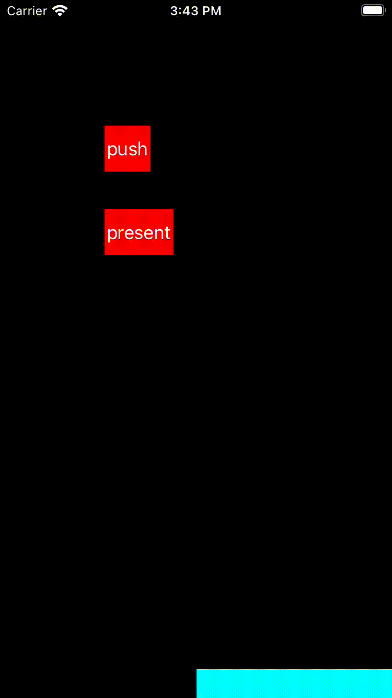

iOS_Custom Transition Animation 自定义转场动画

[TOC]


----

# 1、push-pop 动画协议

想要在 `push` 和 `pop` `viewController` 时使用自定义的转场动效，需要设置`self.naviagtionController.delegate`, 并实现`UINavigationControllerDelegate`的一个方法：

```swift
// 返回一个实现了转场动画协议的对象
func navigationController(_ navigationController: UINavigationController,
                            animationControllerFor operation: UINavigationController.Operation,
                            from fromVC: UIViewController,
                            to toVC: UIViewController) -> UIViewControllerAnimatedTransitioning? {
    if operation == .push {
        return a push animator // 实现push动画的对象
    } 
    if operation == .pop {
        return a pop animator // 实现pop动画的对象
    } 
}
```
----

# 2、present-dismiss 动画协议

想要在 `present` 和 `dismiss` `viewController` 时使用自定义的转场动效，需要设置`toViewController.transitioningDelegate`, 并实现`UIViewControllerTransitioningDelegate`协议的两个方法:

```swift
// 返回一个实现了 present 转场动画协议的对象
func animationController(forPresented presented: UIViewController,
                         presenting: UIViewController,
                         source: UIViewController) -> UIViewControllerAnimatedTransitioning? {
    return a present animator // 实现 present 动画的对象
}
// 返回一个实现了 dismiss 转场动画协议的对象
func animationController(forDismissed dismissed: UIViewController) -> UIViewControllerAnimatedTransitioning? {
    return a pop animator // 实现 dismiss 动画的对象
}
```

*Tips: 这个协议谁实现都可以:`fromVC` or `toVC` or `new an object`, as you like.*

----

# 3、实现转场动画协议

以上2个协议返回的4个`animator`都是实现了`UIViewControllerAnimatedTransitioning`协议的对象。举例实现如下:



## 3.1 动画时长

```swift
func transitionDuration(using transitionContext: UIViewControllerContextTransitioning?) -> TimeInterval {
    return 0.5  // 返回动画时长
}
```
----

## 3.2 push or present animation (显示动画)

执行动画的方法`animateTransition`，带了一个遵循`UIViewControllerContextTransitioning`协议的`transitionContext`参数。具体可以取到哪些数据详情可见[UIViewControllerContextTransitioning](https://developer.apple.com/documentation/uikit/uiviewcontrollercontexttransitioning)。
以下列举一些常用的:
```swift
func animateTransition(using transitionContext: UIViewControllerContextTransitioning) {
    // 1. get data for animation (获取动画需要的数据)
    // animation contianer (动画容器)
    let containerView = transitionContext.containerView
    
    // come from viewController (来源页面的)
    // viewController
    let fromVC = transitionContext.viewController(forKey: .from)
    // view
    let fromView = transitionContext.view(forKey: .from)
    // 初始frame
    let fromViewInitialFrame = transitionContext.initialFrame(for: fromVC)
    // 最终frame
    let fromViewFinalFrame = transitionContext.finalFrame(for: fromVC)
    
    // to viewController (跳转页面的)
    // viewController
    let toVC = transitionContext.viewController(forKey: .to)
    // view
    let toView = transitionContext.view(forKey: .to)
    // 初始frame
    var toViewInitialFrame = transitionContext.initialFrame(for: toVC)
    // 最终frame
    let toViewFinalFrame = transitionContext.finalFrame(for: toVC)
    
    // and so on ...... 
    // do animation with available data (根据拿到的数据做动画)
    
    // 2. calculate the value what you want (计算初始位置+最终位置)
    toViewInitialFrame.origin.x = containerFrame.size.width;
    toViewInitialFrame.origin.y = containerFrame.size.height;
    
    // 3. Add do toView to the contenerView, and set the initial value (添加 toView 到 contianerView 上, 并设置初始值）
    containerView.addSubview(toView)
    toView.frame = toViewInitialFrame;
    
    // Add additional views required for animation and set initial values
    // 添加动画所需的其他视图并设置初始值
    ...... 

    // 4. execute animation 执行动画
    UIView.animate(withDuration: self.transitionDuration(using: transitionContext)) {
        // 5.1 set final frame for animation view
        toView.frame = toViewFinalFrame
        
        // Set additional views final values
        ......
    
    } completion: { finish in
        // 5.2 get animation result
        let success = !transitionContext.transitionWasCancelled
        // 5.2.1 remove the view if animation fail
        if !success {
            toView.removeFromSuperview()
        }
        // 5.2.1 callback animation result
        transitionContext.completeTransition(success)
    }
}
```
----

## 3.3 动画结束

动画结束方法：
```swift
func animationEnded(_ transitionCompleted: Bool) {
    // transitionCompleted 动画执行结果: YES-success NO-fail
}
```
----

## 3.4 pop or dismiss animation (消失动画)

大致跟显示动画一致，转场动画都是需要显示`toView`, 让`fromView`消失

1. 上面显示动画的例子：
是将`toView`加到`containerView`上，并对齐进行动画。
- 动画成功：`toView`就显示在`conatinerView`上，进入的是下一个页面
- 动画失败即转场失败：则应该将`toView`从容器上移除，即还停留在原来的页面上。
2. 以下消失动画的例子：
同样是将`toView`加到`containerView`上，但用的是`fromView`进行动画。
- 动画成功：应将`fromView`从容器上移除，进入下一个页面
- 动画失败即转场失败：则不会移除`fromView`，即还停留在原来的页面上。

```swift
/// 转场动画
func animateTransition(using transitionContext: UIViewControllerContextTransitioning) {
    // 1. get data for animation (获取动画需要的数据)
    ......
    let toViewStartFrame = transitionContext.initialFrame(for: toVC)
    var fromViewFinalFrame = transitionContext.finalFrame(for: fromVC)
    
    // 2. calculate the value what you want (计算初始位置+最终位置)
    fromViewFinalFrame = CGRect(x: CGRectGetWidth(containerFrame),
                                y: CGRectGetHeight(containerFrame),
                                width: CGRectGetWidth(fromView.frame),
                                height: CGRectGetHeight(fromView.frame))
    
    // 3. Add do toView to the contenerView, and set the initial value (添加 toView 到 contianerView 上, 并设置初始值）
    containerView.addSubview(toView)
    toView.frame = toViewStartFrame;
    
    // 4. execute animation 执行动画
    UIView.animate(withDuration: self.transitionDuration(using: transitionContext)) {
        // 5.1 set final frame for animation view
        fromView.frame = fromViewFinalFrame

    } completion: { finish in
        // 5.2 get animation result
        let success = !transitionContext.transitionWasCancelled
        // 5.2.1 remove the view after animation finish
        if success {
            fromView.removeFromSuperview()
        }
        transitionContext.completeTransition(success)
    }
}
```
消失动画里需要注意的是，如果是`pop`是能拿到`toView`，但如果是`dimiss`是拿不到`toView`的。

----

# 4、UIPresentationController

`present`和`dismiss`动画如果想在一个中间的`viewController`进行，则在实现`UIViewControllerTransitioningDelegate`协议时，不要实现以上2个返回`animator`的方法，而是实现以下返回`UIPresentationController`的方法：

```swift
// 返回实现 present-dismiss 动效的VC
func presentationController(forPresented presented: UIViewController,
                            presenting: UIViewController?,
                            source: UIViewController) -> UIPresentationController? {
    return a presentation controller // 实现 present-dismiss 动画的对象
}
```

----

官方这个例子主要的动画是设置`presentVC`的`frame`，`frameOfPresentedViewInContainerView`是`present`的`finalframe`，是`dismiss`的`initialFrame`。
然后在`presentationTransitionWillBegin`和`dismissalTransitionWillBegin`方法里执行的动画，仅是添加了一个偏暗的背景View，然后调整`alpha`动画`显示`和`消失`。

效果如如下：


----

## 4.1 设置presentVC的frame

```swift
// presentVC 在动画容器上的 frame
override var frameOfPresentedViewInContainerView: CGRect {
    get {                    
        let containerBounds: CGRect = self.containerView?.bounds ?? .zero
        let width = CGFloat(floorf(Float(containerBounds.size.width) / 2.0))
        let height = containerBounds.size.height
        let originX = containerBounds.size.width - width
                           
        return CGRect(x: originX, y: 0.0, width: width, height: height)
    }
}
```
----

## 4.2 present 动画

```swift
// 暗色背景
lazy var moDimmingView: UIView = {
    let view = UIView(frame: .zero)
    view.backgroundColor = UIColor(white: 0.0, alpha: 0.4)
    view.alpha = 0.0
    return view
}()
```

```swift
// MARK: - 将要开始 present，设置初始值 和 动画回调
override func presentationTransitionWillBegin() {
    super.presentationTransitionWillBegin()    
    // 1. get animation container view (获取动画容器视图)
    guard let containerView = containerView else { return }
    
    // 2. set initial value for animation views and add to container view (设置动画视图的初始值， 并添加到都到容器上)
    self.moDimmingView.frame = containerView.bounds
    self.moDimmingView.alpha = 0.0
    containerView.insertSubview(self.moDimmingView, at: 0)
    
    // 3. execute animation (执行动画)
    // 这里尝试去拿一个时间点的回调，能拿到就在回调里执行显示动画；拿不到就直接设置显示
    guard let transitionCoordinator = self.presentedViewController.transitionCoordinator else {
        self.moDimmingView.alpha = 1.0
        return
    }
    transitionCoordinator.animateAlongsideTransition(in: self.presentedView) { context in
        self.moDimmingView.alpha = 1.0
    }
}

// MARK: - present 动画结束
override func presentationTransitionDidEnd(_ completed: Bool) {
    super.presentationTransitionDidEnd(completed)    
    // remove dark background view when transition fail
    if !completed {
        self.moDimmingView.removeFromSuperview()
    }
}
```
----

## 4.3 dismiss 动画

```swift
// MARK: - 将要开始 dismiss，设置初始值 和 动画回调
override func dismissalTransitionWillBegin() {
    super.dismissalTransitionWillBegin()    
    guard let transitionCoordinator = self.presentedViewController.transitionCoordinator else {
        self.moDimmingView.alpha = 0.0
        return
    }
    transitionCoordinator.animateAlongsideTransition(in: self.presentedView) { context in
        self.moDimmingView.alpha = 0.0
    }
}

// MARK: - dismiss 动画结束
override func dismissalTransitionDidEnd(_ completed: Bool) {
    super.dismissalTransitionDidEnd(completed)    
    if completed {
        self.moDimmingView.removeFromSuperview()
    }
}
```

---

以上，参照官方的例子，可以根据需要写出想要的动画

---

Demo：[github address](https://github.com/mxh-mo/MOCustomTransitionAnimation)

----

参考：
[Customizing the Transition Animations](https://developer.apple.com/library/archive/featuredarticles/ViewControllerPGforiPhoneOS/CustomizingtheTransitionAnimations.html)
[Creating Custom Presentations](https://developer.apple.com/library/archive/featuredarticles/ViewControllerPGforiPhoneOS/DefiningCustomPresentations.html#//apple_ref/doc/uid/TP40007457-CH25-SW1)


